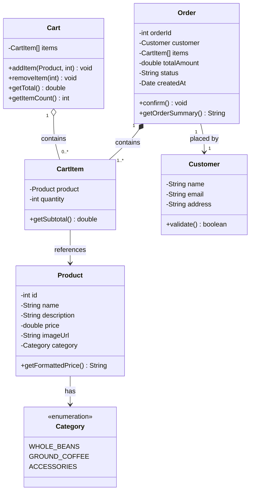

# Klassdiagram — Roast & Brew

Kopiera koden nedan till https://mermaid.live och exportera som PNG.

```mermaid
classDiagram
    class Product {
        -int id
        -String name
        -String description
        -double price
        -String imageUrl
        -Category category
        +getFormattedPrice() String
    }

    class Category {
        <<enumeration>>
        WHOLE_BEANS
        GROUND_COFFEE
        ACCESSORIES
    }

    class CartItem {
        -Product product
        -int quantity
        +getSubtotal() double
    }

    class Cart {
        -CartItem[] items
        +addItem(Product, int) void
        +removeItem(int) void
        +getTotal() double
        +getItemCount() int
    }

    class Order {
        -int orderId
        -Customer customer
        -CartItem[] items
        -double totalAmount
        -String status
        -Date createdAt
        +confirm() void
        +getOrderSummary() String
    }

    class Customer {
        -String name
        -String email
        -String address
        +validate() boolean
    }

    Product --> Category : has
    Cart "1" o-- "0..*" CartItem : contains
    CartItem --> Product : references
    Order "1" --> "1" Customer : placed by
    Order "1" *-- "1..*" CartItem : contains
```
